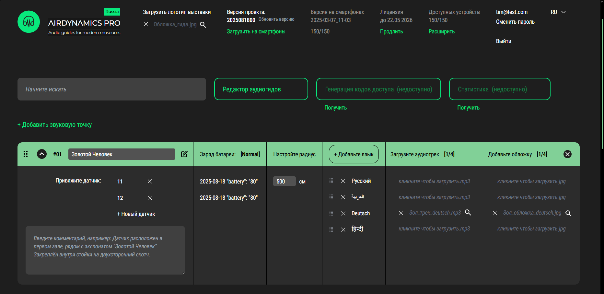

# 👋 Привет, я Фёдор
### Junior Frontend Developer (Vue)

&nbsp;
&nbsp;

---

## 🛠️ Технологический стек
**Основные навыки:**

  &nbsp;
  &nbsp;
  &nbsp;
  &nbsp;
  &nbsp;
  &nbsp;
  

**Дополнительно:**  
Axios | REST API

---

## 🚀 Мои проекты
### Airdynamics Pro  

🟢 **Реальный коммерческий кейс** 

Адаптивная CMS-панель для управления аудиогидами в музеях на Vue  
- Drag-and-drop элементы  
- Интеграция с API  
- Локализация на русском и английском  

### [GrafRide](https://github.com/ALFzz/grafride) | [Демо на Netlify](https://iridescent-cat-0bc2ab.netlify.app)

Адаптивный лендинг с анимациями на Nuxt.js + v-motion  
- Динамичные скролл анимации
- Оптимизированная подгрузка анимационных ресурсов

### [Вкусные моменты](https://github.com/ALFzz/grafride)

Адаптивное веб-приложение для хранения рецептов Vue + Vite + Firebase  
- Система регистрации/входа через FireBase
- Функция сохранения рецептов в избранное
- Создание рецептов
- Создание отзывов сайта и отзывов рецепта

---

## 🎓 Образование
**Московский Политех** (2022–2026)  
Неоконченное высшее по направлению "Информационные системы и технологии"

Специализация: "Информационные технологии в медиаиндустрии и дизайне"

---

## 🌟 О себе
Помимо перечисленных выше навыков, обладаю знаниями веб-оптимизации (lazy loading, работа с изображениями, preload ключевых ресурсов), владею Microsoft Office. Активно изучаю современный стек: Nuxt.js и TypeScript. Легко осваиваю новые технологии, стремлюсь к профессиональному развитию
